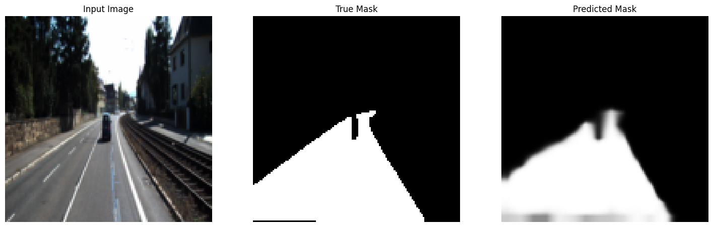

# Lane Detection using VGGNet-16 in PyTorch

This Colab notebook demonstrates how to use a pre-trained VGGNet-16 model in PyTorch to perform lane detection. It involves loading a dataset, setting up data loaders, modifying the VGGNet model for segmentation, and training the model to detect lanes.

## Table of Contents
1. [Dependencies](#dependencies)
2. [Dataset Preparation](#dataset-preparation)
3. [Model Architecture](#model-architecture)
4. [Training and Evaluation](#training-and-evaluation)
5. [Results and Visualizations](#results-and-visualizations)

---

## Dependencies

The following libraries are used in the notebook:

- **PyTorch** for deep learning.
- **Torchvision** for using pre-trained models.
- **Torchsummary** to summarize model architecture.
- **Kaggle API** for downloading datasets.


## Dataset Preparation

### Dataset Source

- The dataset used for lane detection can be downloaded from Kaggle.
- Ensure you have a Kaggle API token set up for direct access.

### Dataset Splits

- The dataset is split into training, validation, and testing sets.
- Each sample contains an image and its corresponding binary mask (1 for lane pixels, 0 elsewhere).

### Custom Dataset Class

A custom PyTorch dataset class is created to load the images and masks from a directory.

---

## Model Architecture

The notebook uses a pre-trained **VGGNet-16** model from `torchvision.models` and modifies it for lane detection by replacing the fully connected layers with upsampling layers to perform segmentation.

### Loading the Pre-trained Model

```python
import torch
import torchvision
from torchsummary import summary

model = torchvision.models.vgg16(pretrained=True)
print(model)
```

### Modifying the Model

1.	Architecture: Fully Convolutional Network (FCN) based on VGG16.
2.	Purpose: Image segmentation, specifically road segmentation.
3.	Encoder:
    *  Uses pre-trained VGG16 feature extraction layers.
    *	Extracts features from VGG16 layers 16, 23, and 30.
4.	Decoder:
    *	Upsamples features with bilinear interpolation.
    *	Uses skip connections to combine encoder and decoder features.
    *	Recovers spatial information.
5.	Output:
    *	Convolutional layer with sigmoid activation for pixel-wise probabilities.
    *	Predicts binary mask (road/background).
6.	Key Components:
    *	nn.Upsample: Upsamples feature maps.
    *	nn.Conv2d: Convolutions in downsampler and output.
    *	nn.Sigmoid: Output activation for probabilities.
    *	Skip connections: Better localization.
7.	Pre-trained Weights: VGG16 encoder initialized with pre-trained weights for faster learning.
8.	Training: Adam optimizer and BCELoss for minimizing prediction errors
---

## Training and Evaluation

### Loss Function and Optimizer

- **Loss Function:** Binary Cross-Entropy Loss (BCELoss)
- **Optimizer:** Adam optimizer


### Training Loop

The model is trained over 200 epochs, and the loss along with IoU is tracked for each epoch.

---

## Results and Visualizations

### Visualization of Predictions

After training, visualize the predicted lane masks overlaid on the original images.




---

## Conclusion

This notebook provides a complete pipeline for lane detection using transfer learning with VGGNet-16 in PyTorch. It covers data preparation, model modifications, training, and visualization of results.

---

### References

- [PyTorch Documentation](https://pytorch.org/docs/stable/index.html)
- [Torchvision Models](https://pytorch.org/vision/stable/models.html)
- [Kaggle API](https://www.kaggle.com/docs/api)

